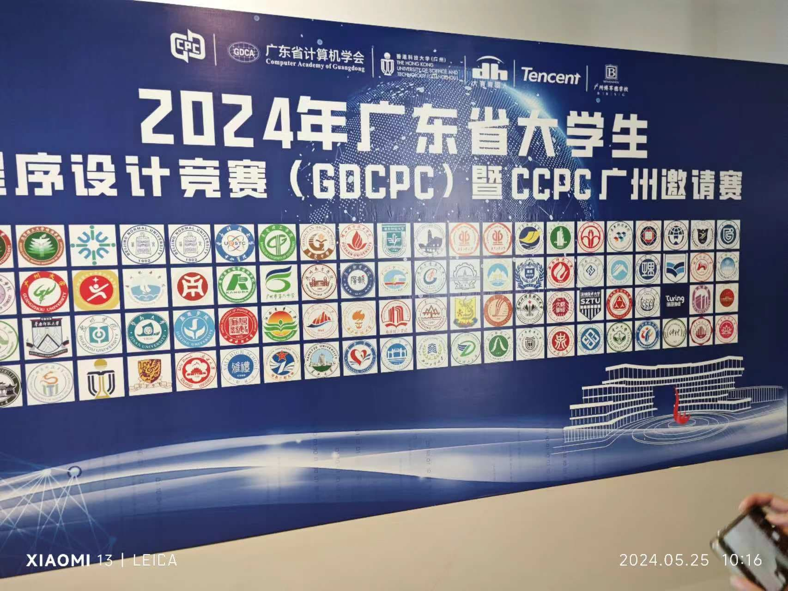
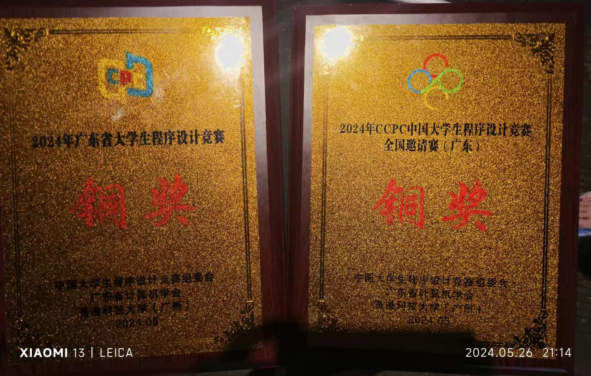
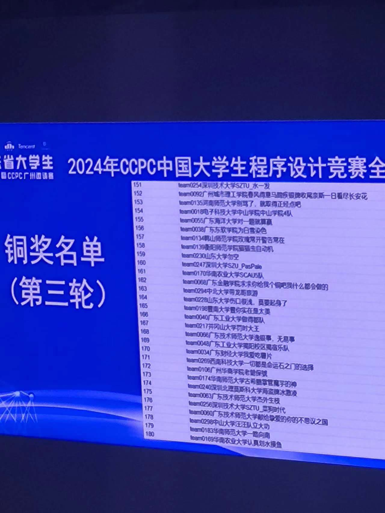
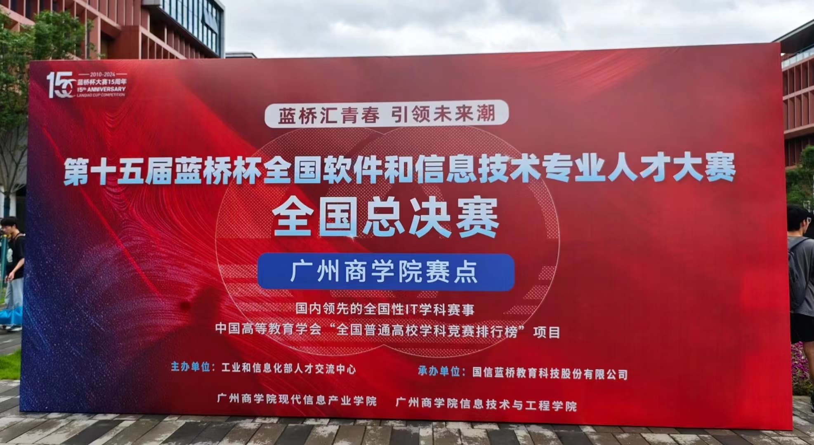
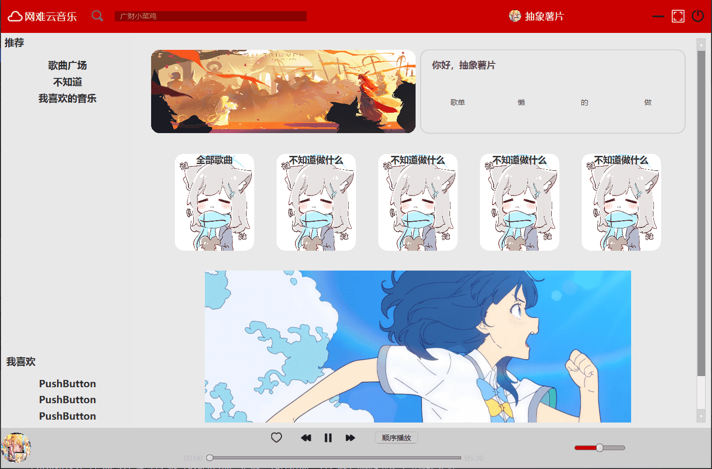

大一感觉过的还可以吧，也算干了点拟人的事情，但是感觉就是太无聊了点，于是我觉得大二时候多出去旅游找点乐子，哦对了，我还在暑假找了一个远程小实习，混个实习证明
# 学了点什么
感觉什么都没学啊
# 竞赛
## 5 26
参加了ccpc，直接被暴打了，赛场上直接给我做懵逼了，还好有cc学长带我飞，不然真成旅游的了，最后也是拿下了铜牌,还是很开心的

## 6 1
参加了蓝桥杯国赛，这个发挥大失败，前面4道题目都做错了，直接跟我干到国三去了，希望大二自己别那么抽象了

# 小玩意
自己也做了点小玩意
## MRS(丐版音乐播放器)
不是什么难做的东西，但是是我做过最难的了，最后也算顺利做出来了吧~~(很多功能都没加)~~

## Vue小玩意
这个就更加简单了，就是一些基础的前端知识，然后连api罢了

## py脚本send email
这个是为了让有人给自己发邮件做的，感觉有点下头
