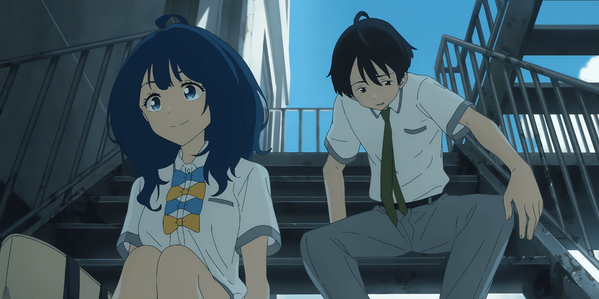
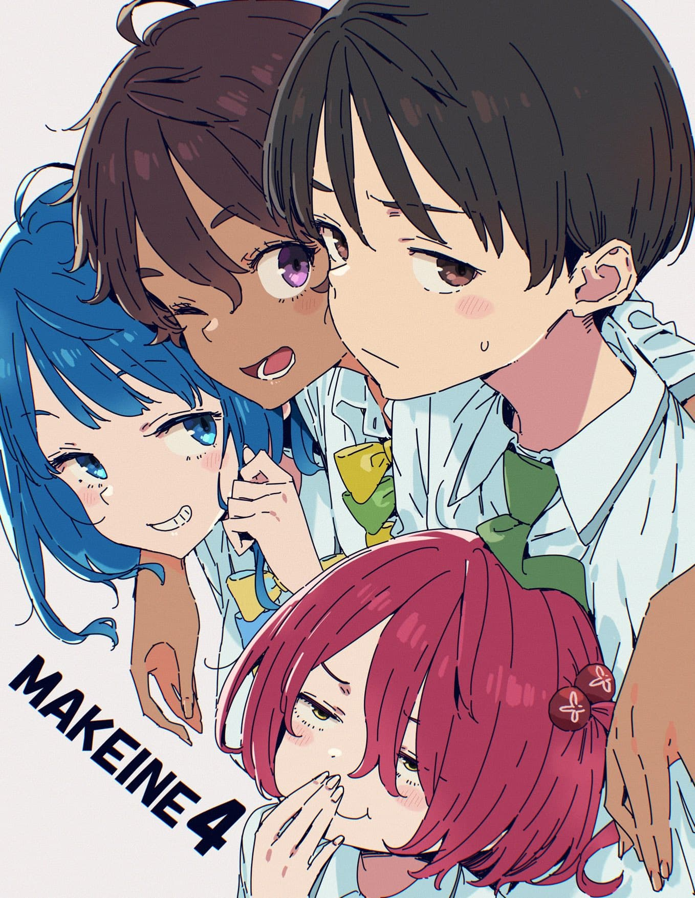

<!-- more -->
之前看败犬看的很疯狂，它总能让我感到一种青春感，但是和同学描述的时候我却说不出为什么，而且很奇怪，这明明就是不可能的青春，和我的青春有半毛钱关系吗？于是我深入的思考了一下这个问题，为什么它能带给我非常浓厚的青春感
# 标签化
本作包括男主在内的人物都是非常标签化的

男主的标签就是宅，老八的就是贪吃，小鞠的就是怕生和BL等等，这些标签化的特征都足够醒目，甚至鲜明的有些过分了，观众瞬间就能在记忆区中描绘出角色形象，而角色也不仅仅是由这些标签所摇摇摆摆的支撑着的，在这些标签之外有杂糅着很多复杂的性格，与内在的闪光点作为血肉来丰满角色，让这些人物具有真实感的同时，很容易让人与自己记忆中的那些美好情节联系到一起，这样自己就会有一种好像自己也有这样一段经历的恍惚，再加上主角的设计也是非常讨巧的，温水被描述为一个平日里面少言寡语，但是偶尔也会想入非非的类似大老师的闷骚角色，并且男主的察言观色的能力也是很好的，非常方便读者带入，毕竟大部分人都有想入非非的时候，人对自己的记忆中的自己往往都会美化一下，所以这样一个男主就很好带入
# 日系校园常见的套路
这个是另一个带来青春感的重要因素，这类讨论也就无外乎某某部学生会、学园祭这些，不过这几板斧下去，你通常都会自动给自己的校园生活添油加醋。不过这个也许要看多了动漫的入脑二次元才可以感受到，这也就可以解释为什么败犬在二次元核心圈子的评分很高，老八在明明毛妹更火的情况下论坛投票中人气爆杀第二，但是在番剧总体的热度处于确实不温不火的状态

要是自己的校园生活真像这样，什么放学后和漂亮妹子一起参加社团活动，还勠力同心的解决各种问题，什么和同班同学为了准备学园祭通宵赶工，然后畅谈人生，什么和后辈一起在学园祭上逛小吃摊，那确实青春到爆炸

但是现实中能体验到其中几个的人又有几个呢？我觉得大部分人应该一个都没有。就是因为没有，那种剧情才可以很好的插入你的脑海中，才能想，啊，这才是青春啊，要是我有这样的事情就好了。
# 人物的感情
对于人物的感情描写都是偏婉约的，这和当今比较流行的工业糖精派就比较有区别，也正是这种朦胧感，才更符合大多数人的青春，而且败犬的剧情往往都是在青春洋溢的背后都是伴随着遗憾的，正是这种不完美的故事，才能让我们感慨，因为谁的青春没有几个遗憾呢。

# 
我想，自己应该就是因为这几个原因才喜欢上败犬的吧，也是因为这样我现在才相对而已更喜欢看一下慢节奏的番剧，没有什么太多的跌宕起伏，也许我真的老了吧，希望自己可以趁自己还年轻，多出去走走看看吧。